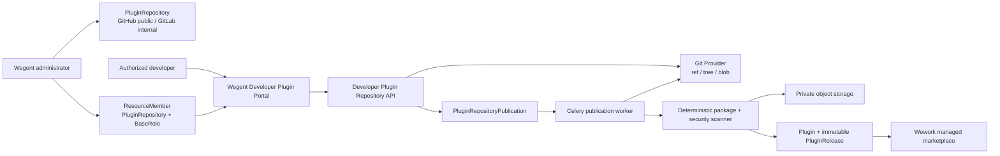

# Git repository plugin publication

Scope: trusted plugin-repository configuration, resource-scoped developer authorization, Git ref inspection, commit-SHA pinning, asynchronous security scanning, and immutable marketplace release publication.



```mermaid
sequenceDiagram
    participant D as Developer Portal
    participant A as Backend API
    participant G as GitHub/GitLab
    participant Q as Celery Worker
    participant S as Scanner/Storage
    participant M as Marketplace DB

    D->>A: inspect(repository, ref)
    A->>A: require Reporter on PluginRepository
    A->>G: resolve allowed ref to commit SHA
    A->>G: read marketplace.json and plugin manifests
    A-->>D: candidates + resolvedCommitSha
    D->>A: publish(slug, ref, expectedCommitSha)
    A->>A: require Developer and re-resolve ref
    alt Ref moved
        A-->>D: 409 REF_MOVED
    else SHA unchanged
        A->>M: create queued publication audit row
        A-->>D: publication id
        Q->>M: claim repository + slug publication
        Q->>G: read plugin tree and blobs at exact SHA
        Q->>S: deterministic package and security scan
        alt Validation or scan fails
            Q->>M: mark failed; do not create ready Release
        else Scan passes
            Q->>S: store immutable package
            Q->>M: bind source repository and publish Release
            Q->>M: mark publication published
        end
    end
```

| Edge | Code ownership |
| --- | --- |
| Administrator to repository configuration and members | Frontend Admin; Backend admin plugin repository API; `ResourceMember` |
| Developer to ref inspection and publication | Frontend Developer Portal; Backend developer plugin repository API |
| Backend to GitHub/GitLab | Plugin Git provider; constrained URL, credentials, and ref policy |
| Publication job to package construction and scan | Celery plugin publication task; official plugin publisher; package scanner |
| Safe package to object storage and Release | Plugin marketplace service; private object storage; MySQL |
| Release to Wework marketplace | Existing Plugin Marketplace V2 catalog and device synchronization flow |

Invariants:

- `users.role` never represents plugin-developer identity. Publication access comes from `ResourceMember(ResourceType.PLUGIN_REPOSITORY)` on an enabled repository: Reporter is read-only, Developer or higher can publish, and administrators configure repositories.
- Developers cannot create repositories, modify credentials, widen visibility, or bypass allowed branch/tag patterns. Repository configuration determines `public` or `workspace` release visibility.
- Inspection returns the resolved commit SHA. Publication resolves the same ref again and requires an exact SHA match. The worker reads only the pinned SHA and never follows a moving branch.
- Public repositories allow only public HTTPS targets; internal GitLab allows only configured hosts. Backend alone decrypts credentials; credentials never reach the browser, logs, or package.
- Marketplace entries and plugin paths are repository-relative. Traversal, symlinks, submodules, Git LFS pointers, excessive file counts, and excessive size are rejected before packaging.
- Repository publication reuses deterministic packaging, the shared security scanner, private object storage, and immutable releases. A failed scan never creates a `ready` release or advances `latest_release_id`.
- A slug binds to one `source_repository_id` on first repository publication. Only an unbound system-owned official plugin may be claimed atomically; submissions, mirrors, and other repositories cannot be taken over.
- Retries of the same `slug + version + SHA256` are idempotent. Reused versions with different content, older versions, and manifest/catalog identity mismatches fail.
- Publication jobs serialize by repository and slug and persist a terminal state. API timeout, worker restart, or temporary Git failure cannot create duplicate releases or a partial catalog state.
- Repository publication permission applies only to that managed source and never grants local ZIP submission permission. Existing community submission and review remain separate.
