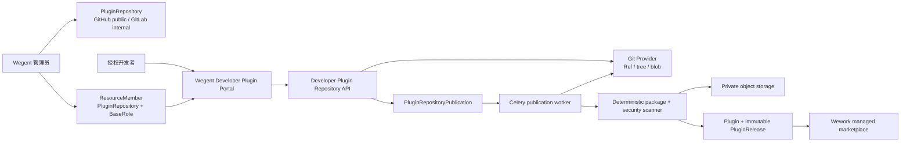

# Git 仓库插件发布

范围：管理员配置受信插件仓库、资源级开发者授权、Git Ref 检查、固定 commit SHA、异步安全扫描和不可变市场 Release 发布。



```mermaid
sequenceDiagram
    participant D as Developer Portal
    participant A as Backend API
    participant G as GitHub/GitLab
    participant Q as Celery Worker
    participant S as Scanner/Storage
    participant M as Marketplace DB

    D->>A: inspect(repository, ref)
    A->>A: require Reporter on PluginRepository
    A->>G: resolve allowed ref to commit SHA
    A->>G: read marketplace.json and plugin manifests
    A-->>D: candidates + resolvedCommitSha
    D->>A: publish(slug, ref, expectedCommitSha)
    A->>A: require Developer and re-resolve ref
    alt Ref moved
        A-->>D: 409 REF_MOVED
    else SHA unchanged
        A->>M: create queued publication audit row
        A-->>D: publication id
        Q->>M: claim repository + slug publication
        Q->>G: read plugin tree and blobs at exact SHA
        Q->>S: deterministic package and security scan
        alt Validation or scan fails
            Q->>M: mark failed; do not create ready Release
        else Scan passes
            Q->>S: store immutable package
            Q->>M: bind source repository and publish Release
            Q->>M: mark publication published
        end
    end
```

| 边 | 代码归属 |
| --- | --- |
| 管理员 → 仓库配置与成员 | Frontend Admin；Backend admin plugin repository API；`ResourceMember` |
| 开发者 → Ref 检查与发布 | Frontend Developer Portal；Backend developer plugin repository API |
| Backend → GitHub/GitLab | Plugin Git provider；受限 URL、凭据和 Ref 策略 |
| 发布任务 → 包构建与扫描 | Celery plugin publication task；official plugin publisher；package scanner |
| 安全包 → 对象存储与 Release | Plugin marketplace service；private object storage；MySQL |
| Release → Wework 市场 | 既有 Plugin Marketplace V2 目录与设备同步链路 |

不变量：

- `users.role` 不表达插件开发者身份。发布权限必须来自启用仓库上的 `ResourceMember(ResourceType.PLUGIN_REPOSITORY)`；Reporter 只读，Developer 及以上可发布，管理员可配置。
- 开发者不能创建仓库、修改凭据、扩大可见性或绕过允许的 branch/tag 模式。仓库决定 Release 的 `public` 或 `workspace` 可见性。
- 检查结果必须返回解析后的 commit SHA；发布时重新解析同一 Ref 并要求 SHA 一致。Worker 只读取已固定 SHA，不能跟随移动分支。
- 公开仓库只允许 HTTPS 公网目标；内部 GitLab 只允许配置白名单中的主机。凭据只在 Backend 解密使用，不返回浏览器、不写日志和发布包。
- 市场清单和插件路径必须是仓库内相对路径。越界路径、符号链接、子模块、Git LFS 指针、超量文件和超限体积必须在打包前拒绝。
- Git 仓库发布仍复用统一确定性打包、安全扫描、私有对象存储和不可变 Release。扫描失败不得生成 `ready` Release 或提升 `latest_release_id`。
- 同一 slug 首次仓库发布后绑定唯一 `source_repository_id`。只有未绑定的系统官方插件可以被首次原子认领；用户投稿、镜像或其他仓库的 slug 不得被接管。
- 同 `slug + version + SHA256` 重试幂等；同版本不同内容、低于当前版本或 Manifest/清单身份不一致必须失败。
- 发布任务必须按“仓库 + slug”串行化并持久化终态。API 超时、Worker 重启或 Git 暂时不可用不能造成重复 Release 或半成品目录状态。
- Git 仓库发布权只适用于该受管源码，不授予 Wework 本地 ZIP 投稿能力；既有社区投稿和审核链路保持独立。
